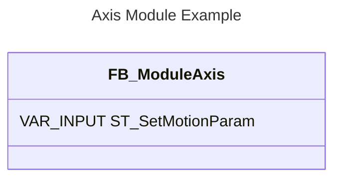

<h1 align="left">
   
  
   
  HEI-Vs Engineering School
   
</h1>

# CtrlX Core Basler Calibration

This programm use PackML with name HEVS_Pack_2022. [There is a document here which explain how it is used in this program](./Using_HEVS_Pack_2022.md).

## To use this tool

1.  You need the Siemens Interface ``AuBoxPn_128_InOut_Beta_2.zap`` loaded in the S7
2.  You need a folder with name: ``Document/AutRob``
3.  You need a folder with name: ``Document/AutRob/imgRobot``  
4.  You need to extract ``plc/CtrlX_BaslerCalibration.projectarchive`` and load it on the CltrX Core
5.  You need the Node-Red Flow ``BaslerCalibration.json``
6.  You can load the scripts: ``NodeOneShotBasler.py``, ``NodeOneShotBaslerXYZ.py`` and ``NodeUpdateBasler.py`` on ``Document/AutRob/`` or generate them from Node-RED in To Python Flow Generate File.

##If successfully installed

1.  You can run the robot in manual mode
2.  You can take snapshots with the Basler Camera
3.  You can run the program in Automatic mode if the plate and the robot are correctly alligned.

This project, based on HEVS_CtrlX_Pack_ABox is intended for a lab to use Python scripts to capture images from the Basler Camera.

# Authentification
> The first time a Node-RED is used on a PC, a node should be have and Authentification. For the automation lab, we use default login and password: boschrexroth / boschrexroth.

# Software and version

## Node RED
Node red run on lab computer.
Node red must be started using the ``windows cmd`` line: ``node-red``
Node-red must be insalled with 

Node.js v20.18.1
Node-RED v4.0.5

### Node RED Palette
- node-red-dashboard  1.20.0
- node-red-contribut-ctrlx-automation 1.9.7
- node-red-contrib-opc-ua 0.2.339

## Basler Pylon
pylon Release 7.5.0.15658

## Python
Version 3.12

# CtrlX Core PLC
Should be stored in the PLC
Else, look for program \GIT_Repo\ctrlx_basler_calibration\plc\

