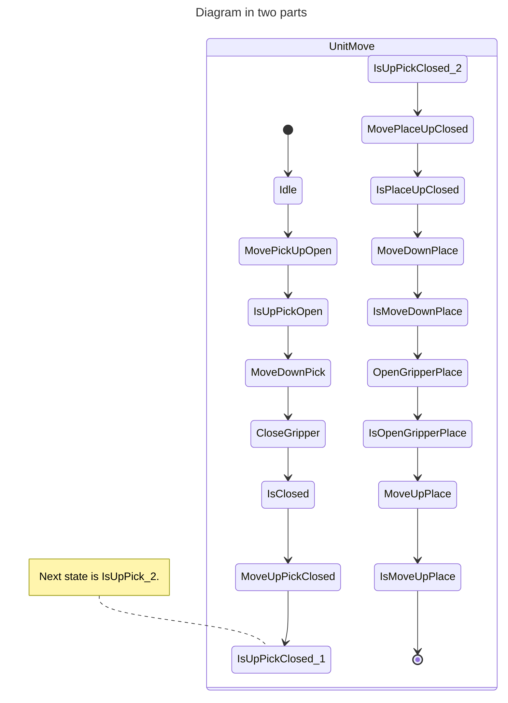
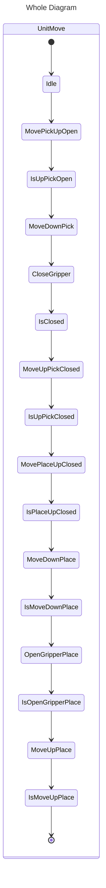

<h1 align="left">
  <br>
  
  <br>
  HEI-Vs Engineering School
  <br>
</h1>

# Robot pick and place motion.

|Y id    |X left  |X Right|
|--------|--------|-------|
| 1      | Pos 1  | Pos 6 |
| 2      | Pos 2  | Pos 7 |
| 3      | Pos 3  | Pos 8 |
| 4      | Pos 4  | Pos 9 |
| 5      | Pos 5  | Pos 10 |

|Y id    |X left  |X Right|
|--------|--------|-------|
| 1      | X = -199, Y = -78, Z = -145| X = -199, Y = -78, Z = -145|
| 2      |        |       |
| 3      |X = -199, Y = 2, Z = -145|X = -119, Y = 2, Z = -145       |
| 4      |        |       |
| 5      |        |       |

Z Flight position = -95 (Offset = +50)

Position 3 := X-119 / Y 2 / Z -145

# Base Partial State Machine






```iec61131
TYPE E_UnitMoveForPickAndPlace :
(
    Idle            := 999,
    CloseGripper    := 10,
    IsClosed        := 20,
    MoveUp          := 30,
    IsUp            := 40,
    MoveFlat        := 50,
    ReadyToGoDown   := 60,
    MoveDown        := 70,
    IsDown          := 80,
    MotionError     := 999
)  := MotionError;
END_TYPE
```


```iec61131
PROGRAM PickAndPlaceStateMachine
VAR
  currentState : E_UnitMoveForPickAndPlace := E_UnitMoveForPickAndPlace.Idle;
END_VAR

CASE currentState OF
  E_UnitMoveForPickAndPlace.Idle:
    (* Code for Idle state *)
    currentState := E_UnitMoveForPickAndPlace.CloseGripper;
    
  E_UnitMoveForPickAndPlace.CloseGripper:
    (* Code to close gripper *)
    currentState := E_UnitMoveForPickAndPlace.IsClosed;
    
  E_UnitMoveForPickAndPlace.IsClosed:
    (* Code to check if gripper is closed *)
    currentState := E_UnitMoveForPickAndPlace.MoveUp;
    
  E_UnitMoveForPickAndPlace.MoveUp:
    (* Code to move up *)
    currentState := E_UnitMoveForPickAndPlace.IsUp;
    
  E_UnitMoveForPickAndPlace.IsUp:
    (* Code to check if in up position *)
    currentState := E_UnitMoveForPickAndPlace.MoveFlat;
    
  E_UnitMoveForPickAndPlace.MoveFlat:
    (* Code to move flat *)
    currentState := E_UnitMoveForPickAndPlace.ReadyToGoDown;
    
  E_UnitMoveForPickAndPlace.ReadyToGoDown:
    (* Code to prepare for moving down *)
    currentState := E_UnitMoveForPickAndPlace.MoveDown;
    
  E_UnitMoveForPickAndPlace.MoveDown:
    (* Code to move down *)
    currentState := E_UnitMoveForPickAndPlace.IsDown;
    
  E_UnitMoveForPickAndPlace.IsDown:
    (* Code to check if in down position *)
    currentState := E_UnitMoveForPickAndPlace.Idle;
    
  ELSE
    (* Handle unexpected states *)
    currentState := E_UnitMoveForPickAndPlace.MotionError;
END_CASE
```
