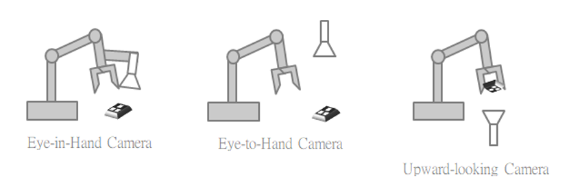

<h1 align="left">
  <br>
  
  <br>
  HEI-Vs Engineering School
  <br>
</h1>

# A Look at the Current Challenges of Robot Vision

[More info here: A Look at the Current Challenges of Robot Vision](https://www.tm-robot.com/en/a-look-at-the-current-challenges-of-robot-vision/)

## Keywords

<figure>
    
    <figcaption>Robot 3d vision Camera</figcaption>
</figure>

> The system of the lab is a Eye-In-Hand Camera


[Position-Based Visual Servoing in Industrial Multirobot Cells Using a Hybrid Camera Configuration](https://www.researchgate.net/figure/Eye-in-hand-eye-to-hand-cameras_fig3_3450392)

[High precision hand-eye self-calibration for industrial robots](https://www.semanticscholar.org/paper/High-precision-hand-eye-self-calibration-for-robots-Lee-Kim/df8ab32cf1ec943b9bcd4cd2939c237a5211d56f)

# La référence
[ieee link: Calibrating a Cartesian robot with eye-on-hand configuration independent of eye-to-hand relationship](https://ieeexplore.ieee.org/document/35495)

Calibrating a Cartesian robot with eye-on-hand configuration independent of eye-to-hand relationship [en local](Calibrating_a_Cartesian_robot_with_eye-on-hand_configuration_independent_of_eye-to-hand_relationship.pdf)

[ieee link: A new technique for fully autonomous and efficient 3D robotics hand/eye calibration](https://ieeexplore.ieee.org/document/34770)

A new technique for fully autonomous and efficient 3D robotics hand/eye calibration [en local](./A_new_technique_for_fully_autonomous_and_efficient_3D_robotics_hand_eye_calibration.pdf)

# Selon Matlab
[Estimate Pose of Moving Camera Mounted on a Robot](https://ch.mathworks.com/help/vision/ug/estimate-pose-of-moving-camera-mounted-on-a-robot.html)

Attention, selon la recherche sur le mot clé robotModel, ce document implique la connaissance du model.

## robotModel
Use Model **kinovaGen3**
```
robotModel = loadrobot("kinovaGen3");
robotModel.DataFormat = "column";
```

## endEffectorToBaseTform
Use **robotModel**
```
endEffectorToBaseTform(numPoses,1) = rigidtform3d; 
for i = 1:numPoses   
    jointPositionsRad = deg2rad(jointPositionsDeg(i,:))'; % Convert the pose angles from degrees to radians.
    endEffectorToBaseTform(i) = getTransform(robotModel,jointPositionsRad,"EndEffector_Link");
end
```

## cameraToEndEffectorTform
Use **endEffectorToBaseTform**
```
config = "eye-in-hand";
cameraToEndEffectorTform = helperEstimateHandEyeTransform(camExtrinsics,endEffectorToBaseTform,config)
```