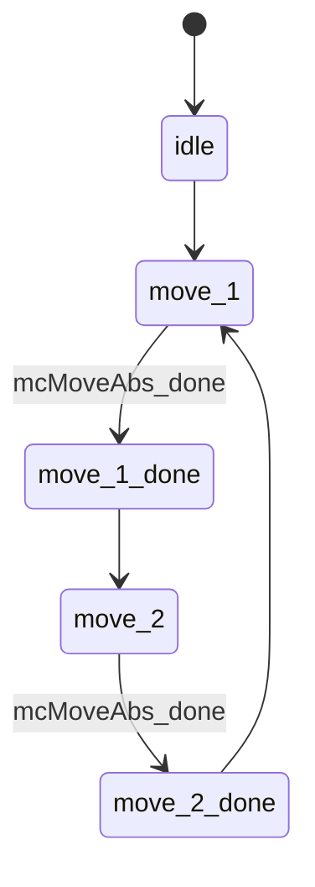

```iecst
TYPE E_MoveState : (
    eIdle        := 99,
    eMove_1      := 10,
    eMove_1_done := 20,
    eMove_2      := 30,
    eMove_2_done := 40
) DINT := eIdle;
END_TYPE
```
```iecst
VAR
    moveState : E_MoveState := eIdle;
    mcMoveAbs : MC_MoveAbsolute;
END_VAR

CASE moveState OF
    E_MoveState.eIdle:
        // Transition to move_1
        moveState := E_MoveState.eMove_1;

    E_MoveState.eMove_1:
        IF mcMoveAbs.Done THEN
            moveState := E_MoveState.eMove_1_done;
        END_IF

    E_MoveState.eMove_1_done:
        // Transition to move_2
        moveState := E_MoveState.eMove_2;

    E_MoveState.eMove_2:
        IF mcMoveAbs.Done THEN
            moveState := E_MoveState.eMove_2_done;
        END_IF

    E_MoveState.eMove_2_done:
        // Loop back to move_1
        moveState := E_MoveState.eMove_1;

    ELSE
        // Default to idle in case of unexpected state
        moveState := E_MoveState.eIdle;
END_CASE

mcMoveAbs.Execute := (moveState = E_MoveState.eMove_1 OR
                      moveState = E_MoveState.eMove_2);

mcMoveAbs(Axis := axisRef,
          Velocity := stSetParam.rVelocity_m_s,
          Acceleration := stSetParam.rAcceleration_m_s2,
          Deceleration := stSetParam.rDeceleration_m_s2,
          Jerk := stSetParam.rJerk_m_s3);

```
