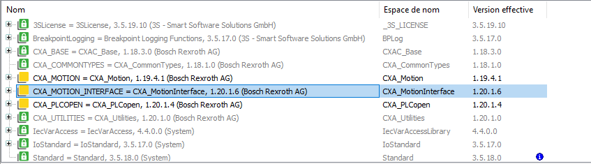

<h1 align="left">
   
  
   
  HEI-Vs Engineering School
   
</h1>

# Motion Interface

This project example use motion APP and libraries of CtrlX Core.

## Motion libraries

<figure>
    
    <figcaption>CXA Motion Libraries</figcaption>
</figure>