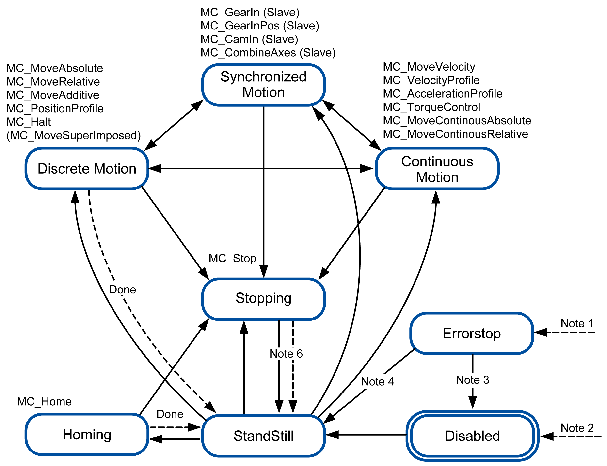

<h1 align="left">
   
  
   
  HEI-Vs Engineering School
   
</h1>

# Pack Robot

Pack Robot is an application example of HEVS Pack using the Rexroth Robots of the HEVS Autamation Lab.

# PLCopen Motion Control
To understand the use of PackML with PLCopen Function Block for motion, it is important do understand the State Machine and states provided by ``MC_ReadStatus``.

Below an example given by Schneider Electric

<figure>
    
    <figcaption>PLCopen Motion State Machine</figcaption>
</figure>