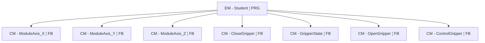
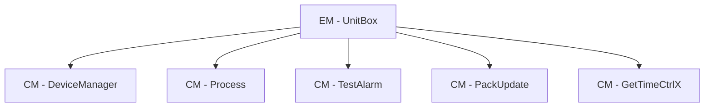
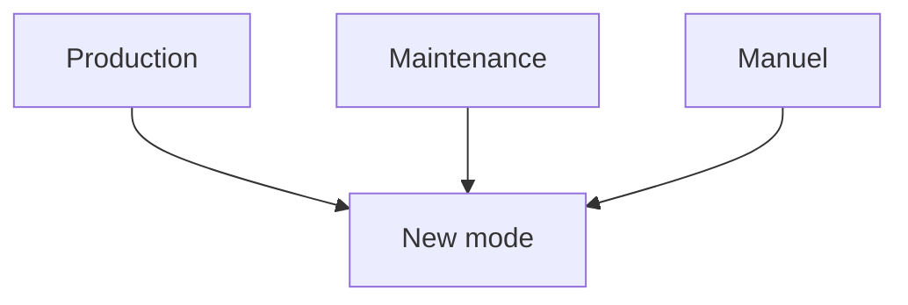

<h1 align="left">
  <br>
  
  <br>
  HEI-Vs Engineering School
  <br>
</h1>

# HEVS Pack ML

- [HEVS Pack ML](#hevs-pack-ml)
	- [1. Définition d'un pack ML](#1-définition-dun-pack-ml)
	- [2. Objectif du pack ML HEVS](#2-objectif-du-pack-ml-hevs)
	- [3. Composition du pack ML HEVS](#3-composition-du-pack-ml-hevs)
		- [Dossiers du pack ML HEVS :](#dossiers-du-pack-ml-hevs-)
		- [3.1. ABox](#31-abox)
		- [3.2. HEVS\_Pack\_2022](#32-hevs_pack_2022)
			- [FB\_HEVS\_SetAlarm](#fb_hevs_setalarm)
			- [FB\_HEVS\_SetWarning](#fb_hevs_setwarning)
			- [FB\_HEVS\_StopReason](#fb_hevs_stopreason)
			- [FC\_HEVS\_GetAckAlarmById](#fc_hevs_getackalarmbyid)
			- [FC\_HEVS\_GetAckWarningById](#fc_hevs_getackwarningbyid)
			- [FB\_GetActualBoolState](#fb_getactualboolstate)
			- [FB\_PackMasterMode](#fb_packmastermode)
			- [FB\_PackMasterState](#fb_packmasterstate)
			- [PLC\_PACK (PRG)](#plc_pack-prg)
		- [3.3. HEVS\_Robot](#33-hevs_robot)
		- [3.4. HEVS\_UnitBox](#34-hevs_unitbox)
		- [3.5. Student](#35-student)
	- [4. Structure Pack ML](#4-structure-pack-ml)
		- [4.1. Structure Pack ML HEVS](#41-structure-pack-ml-hevs)
	- [4.2. Control Module (CM)](#42-control-module-cm)
	- [4.3. Equipment Module (EM)](#43-equipment-module-em)
	- [4.4. Modes](#44-modes)
				- [FB\_PackModeBoolInterface](#fb_packmodeboolinterface)
	- [4.5. States / Etats](#45-states--etats)
				- [17 états d'un PackML](#17-états-dun-packml)
				- [Différence entre Held et Suspend](#différence-entre-held-et-suspend)
	- [5. Utilisation du Pack ML HEVS](#5-utilisation-du-pack-ml-hevs)
		- [5.1. Création d'un FB](#51-création-dun-fb)
		- [5.2. Création d'un PRG](#52-création-dun-prg)
		- [5.3. Création d'un warning](#53-création-dun-warning)
		- [5.4. Création d'une alarme](#54-création-dune-alarme)
		- [5.5. Création d'un mode](#55-création-dun-mode)
	- [6. Node-RED](#6-node-red)
	- [7. Choses à savoir](#7-choses-à-savoir)
		- [7.1. Vocabulaire](#71-vocabulaire)
		- [7.2. Astuces](#72-astuces)


## 1. Définition d'un pack ML
PackML est l'acronyme anglais de Packaging Machine Language. Il s'agit d'une norme d'emballage utilisée dans le secteur du contrôle de machine, spécifiquement pour les machines d'emballage.
## 2. Objectif du pack ML HEVS
Le but de ce pack ML est que tout étudiant ou personne, ayant des bases en automation, puissent avoir déjà un programme déjà bien fourni pour débuter un projet pour contrôler un ou plusieurs modules comme une pince ou des axes.
Les avantages de commencer avec un pack ML :
  - Gain de temps (environ 15h)
  - Simplifier un début de projet
  - Départ avec une structure propre
## 3. Composition du pack ML HEVS
Le pack ML est basé et construit selon la norme ISA88.
Voici la structure général du PLC code

Le pack ML est constitué de 5 dossiers. Tous seront séparés en 2 parties :
- DUT avec des structures (STRUCT) ou/et énumération (ENUM)
- POU avec des Function Block (FB) et Programme (PRG)
Dans le FB, il y a des Actions (ACT), qui ont pour but de séparer chaque état. Tout ceci a pour but de structurer le FB.
Dans PRG-Student ou CM_ControlGripper il y a 1 ACT par état. Dans chaque ACT, nous pouvons écrire une state Machine.

### Dossiers du pack ML HEVS :
### 3.1. ABox
Ce dossier fait le lien avec l'interface (HMI) et le hardware (bouton, pince, capteur).

### 3.2. HEVS_Pack_2022
Cette partie rassemble les alarmes, les warning, le Packtag et d'autres choses. La différence entre warning et alarm est expliqué dans le chapitre ***Vocabulaire***.

Les alarmes et warning peuvent être déclenchées et testées via le tableau des alarmes dans le NODE-red.

Des listes des warnings et alarmes en cours sont disponibles. Lorsqu'un warning est quittancé, en le sélectionnant, le warning disparait. Il n'y a pas d'historique pour les warnings.
Pour supprimer une alarme, il faudra effectuer une action. Dès que l'alarme n'est plus active, elle aparait dans l'historique. Ceci a pour but de suivre l'état de la machine, par exemple au long d'une journée ou semaine. Ceci permet d'analyser les problèmes et trouver des améliorations.

#### FB_HEVS_SetAlarm
Si la fonction est appelée avec l'entrée xSetAlarm = TRUE, elle vérifie si le message d'alarme spécifié figure déjà dans la liste des alarmes actives.
Si ce n'est pas le cas, la fonction récupère l'horloge temps réel du contrôleur et l'écrit avec le message d'alarme spécifié dans la liste des alarmes actives.
Si le nombre maximal de messages dans la liste est atteint, aucun nouveau message n'est ajouté et bMaxNbOfAlarmReached est défini sur TRUE.

| Name             | Type   | Direction | Description |
|------------------|--------|-----------|-------------|
| xSetAlarm        | BOOL   | Input     | Active on state |
| xAckAlarmTrig    | BOOL   | Input     | Active on rising edge |
| ID               | DINT   | Input     | Event Configuration: ID |
| Value            | DINT   | Input     | Event Configuration: Value |
| Message          | STRING | Input     | Event Configuration: Message |
| Category         | DINT   | Input     | Event Configuration: Category |
| xAutoAcknowledge | BOOL   | Output    |             |
| xMaxNbOfAlarmReached | BOOL | Output  |             |
| stErrorString    | STRING | Output    |             |

#### FB_HEVS_SetWarning
Si la fonction est appelée avec l'entrée xSetWarning = TRUE, elle vérifie si le message du warning spécifié figure déjà dans la liste des warning actifs.
Si ce n'est pas le cas, la fonction récupère l'horloge temps réel du contrôleur et l'écrit avec le message du warning spécifié dans la liste des warnings actifs.
Si le nombre maximal de messages dans la liste est atteint, aucun nouveau message n'est ajouté et bMaxNbOfAlarmReached est défini sur TRUE.

| Name                  | Type   | Direction | Description                      |
|-----------------------|--------|-----------|----------------------------------|
| xSetWarning           | BOOL   | Input     | Active on state                  |
| xAckWarningTrig       | BOOL   | Input     | Active on rising edge            |
| ID                    | DINT   | Input     | Event Configuration: ID          |
| Value                 | DINT   | Input     | Event Configuration: Value       |
| Message               | STRING | Input     | Event Configuration: Message     |
| Category              | DINT   | Input     | Event Configuration: Category    |
| xAutoAcknowledge      | BOOL   | Output    |                                  |
| xMaxNbOfAlarmReached  | BOOL   | Output    |                                  |
| stErrorString         | STRING | Output    |                                  |

#### FB_HEVS_StopReason
Bloc fonctionnel permettant de déclencher une alarme à l'aide de PackML 2022.
Il extrait un motif d'arrêt de la liste des alarmes actives.

| Name                  | Type                                                        | Direction  | Default Value         | Description                                 |
|-----------------------|-------------------------------------------------------------|------------|----------------------|---------------------------------------------|
| SuspendCategory       | DINT                                                        | Input      | 1                    | With default value 1                        |
| HoldCategory          | DINT                                                        | Input      | 2                    | With default value 2                        |
| StopCategory          | DINT                                                        | Input      | 3                    | With default value 3                        |
| AbortCategory         | DINT                                                        | Input      | 4                    | With default value 4                        |
| CompleteCategory      | DINT                                                        | Input      | 6                    | With default value 6                        |
| stStopReason          | HEVS_PackTag_Event                                          | InOut      |                      |                                             |
| stAdminAlarm          | ARRAY[0..HEVS_PackTag_GVL.C_ADMIN_MAXALARMS] OF HEVS_PackTag_Event | InOut      |                      |                                             |
| SuspendCmd            | BOOL                                                        | Output     |                      |                                             |
| HoldCmd               | BOOL                                                        | Output     |                      |                                             |
| StopCmd               | BOOL                                                        | Output     |                      |                                             |
| AbortCmd              | BOOL                                                        | Output     |                      |                                             |
| CompleteCmd           | BOOL                                                        | Output     |                      |                                             |
| stopReasonToMaster    | E_PackCmd                                                   | Output     | E_PackCmd.eUndefined | Use to activate Stop Reason on FB_PackMasterState |

#### FC_HEVS_GetAckAlarmById
Bloc fonctionnel permettant de quittancer une alarme.
À utiliser comme déclencheur pour FB_HEVS_SetAlarm.xAckAlarmTrig

La version actuelle nécessite toujours HEVS_PackTag_UI.
Si ThisAlarmId = uiAlarmGetId, uiAlarmGetId est réinitialisé à 0.
Cela signifie que la valeur TRUE ne sera renvoyée qu'une seule fois.


| Name        | Type | Direction | Description                |
|-------------|------|-----------|----------------------------|
| ThisAlarmId | DINT | Input     | ID of the alarm to acknowledge |
| FC_HEVS_GetAckAlarmById | BOOL | Return   | Returns TRUE if the alarm with the given ID is acknowledged |

#### FC_HEVS_GetAckWarningById
Bloc fonctionnel permettant de quittancer un warning.
A utiliser comme déclencheur de FB_HEVS_SetWarning.xAckAlarmTrig
		
	The current version still need HEVS_PackTag_UI
	IF ThisWarningId = uiWarningGetId, uiWarningGetId is reset to 0.
	That is, will return TRUE only one time.
| Name              | Type | Direction | Description                          |
|-------------------|------|-----------|--------------------------------------|
| ThisWarningId     | DINT | Input     | ID of the warning to acknowledge     |
| FC_HEVS_GetAckWarningById | BOOL | Return   | Returns TRUE if the warning with the given ID is acknowledged |

#### FB_GetActualBoolState
Ce bloc fonctionnel renvoie le format d'état booléen : PackTag.Status.StateCurrent

| Name         | Type        | Direction  | Description                |
|--------------|-------------|------------|----------------------------|
| Enable       | BOOL        | Input      | Enable the FB              |
| ePackState   | E_PackState | Input      | Current PackML state       |
| Active       | BOOL        | Output     | FB is active               |
| Clearing     | BOOL        | Output     | Clearing state             |
| Stopped      | BOOL        | Output     | Stopped state              |
| Starting     | BOOL        | Output     | Starting state             |
| Idle         | BOOL        | Output     | Idle state                 |
| Suspended    | BOOL        | Output     | Suspended state            |
| Execute      | BOOL        | Output     | Execute state              |
| Stopping     | BOOL        | Output     | Stopping state             |
| Aborting     | BOOL        | Output     | Aborting state             |
| Aborted      | BOOL        | Output     | Aborted state              |
| Holding      | BOOL        | Output     | Holding state              |
| Held         | BOOL        | Output     | Held state                 |
| Unholding    | BOOL        | Output     | Unholding state            |
| Suspending   | BOOL        | Output     | Suspending state           |
| Unsuspending | BOOL        | Output     | Unsuspending state         |
| Resetting    | BOOL        | Output     | Resetting state            |
| Completing   | BOOL        | Output     | Completing state           |
| Completed    | BOOL        | Output     | Completed state            |
#### FB_PackMasterMode
Mode manager
La valeur par défaut au démarrage est le mode Production := 1
| Name                        | Type                   | Direction   | Default Value                        | Description                                                                                   |
|-----------------------------|------------------------|-------------|--------------------------------------|-----------------------------------------------------------------------------------------------|
| Enable                      | BOOL                   | Input       |                                      | Enable the FB                                                                                 |
| UMCC_UnitModeChangeComplete | BOOL                   | Input       | TRUE                                 | Must be TRUE when all modules have finished change; TRUE by default if no delay is requested  |
| StartupMode                 | DINT                   | Input       | E_PackModes.Production               | Read once at first cycle, cannot be changed later                                             |
| Cmd_UnitMode                | DINT                   | Input       |                                      | Command selected mode, must be present when Cmd_UnitModeChangeRequest is activated            |
| Cmd_UnitModeChangeRequest   | BOOL                   | Input       |                                      | Command is set upon rising edge of the boolean                                                |
| Sts_StateCurrent            | DINT                   | Input       | E_PackState.eAborted                 | Actual state needed to determine if transition is possible                                    |
| Admin_ref                   | HEVS_PackTag_Admin     | InOut       |                                      | Reference to admin, used to adjust settings when changing mode                                |
| Active                      | BOOL                   | Output      |                                      | FB is active                                                                                  |
| Sts_UnitModeCurrent         | DINT                   | Output      |                                      | Current unit mode (Invalid=0, Production=1, Maintenance=2, Manual=3, Test=4)                  |
| Sts_UnitModeRequested       | DINT                   | Output      |                                      | Requested unit mode, invalid if not Cmd_UnitModeChangeRequest                                 |
| Sts_UnitModeChangeInProcess | BOOL                   | Output      |                                      | Indicates if a unit mode change is in process                                                 |
| stringUnitModeCurrent       | STRING                 | Output      |                                      | UnitModeCurrent in STRING format                                                              |
| stringModeInfo              | STRING                 | Output      |                                      | Change mode help/info                                                                         |
#### FB_PackMasterState
State manager
| Name                    | Type         | Direction | Default Value                | Description                                                                                 |
|-------------------------|--------------|-----------|------------------------------|---------------------------------------------------------------------------------------------|
| Enable                  | BOOL         | Input     |                              | Enable the FB                                                                               |
| SC_StateComplete        | BOOL         | Input     |                              | Current acting state of each module is finished                                              |
| Command_CntrlCmd        | E_PackCmd    | Input     |                              | Control command                                                                             |
| Command_CmdChangeRequest| BOOL         | Input     |                              | Command change request                                                                      |
| StopReasonCntrlCmd      | E_PackCmd    | Input     | E_PackCmd.eUndefined         | Transform a Stop Reason to command; set to 0 or eUndefined if unused                        |
| Admin_CurDisabledStates | DWORD        | Input     | 0                            | 32-bit list of disabled states; default is 0                                                |
| Active                  | BOOL         | Output    |                              | FB is active                                                                                |
| Status_StateRequested   | DINT         | Output    |                              | Requested state                                                                             |
| Status_StateChangeInProcess | BOOL     | Output    |                              | Indicates if a state change is in process                                                   |
| Status_StateCurrent     | DINT         | Output    |                              | Current state                                                                               |
| timeOut                 | BOOL         | Output    |                              | TRUE if SC_StateComplete not present for more than timeout; can be used for a warning       |
| strState                | STRING       | Output    | 'FB not Active'              | State for UI diagnostic and info                                                            |
| strDiagnostic           | STRING       | Output    | 'FB not active'              | Diagnostic string for UI                                                            |

#### PLC_PACK (PRG)
**ACT_SetDefaultSettings**
Dans ce PRG, nous savons les modes qui sont activés. De plus, nous pouvons savoir si les modes ont les 17 états actifs où si certains sont désactivés. Nous savons également les transitions de mode possibles et dans quels états ceux-ci son faisables.

### 3.3. HEVS_Robot
Ce dossier va gérer les modules.
C'est-à-dire les déplacement en X,Y,Z et également la pince, dans notre cas.
### 3.4. HEVS_UnitBox
Spécifique pour l'hardware (DeviceManager, Process, Tools). 
le programme *PRG_GetTime_CtrlX* est spécifique pour l'installation sur Bosch Rexroth.
### 3.5. Student
Espace réservé à l'utilisateur.  L'implémentation de séquences personnalisées est fait dans ce dossier.

## 4. Structure Pack ML 
Voici la structure d'un pack ML avec les 3 niveaux (Unit, Equipment Module, Control Module)


### 4.1. Structure Pack ML HEVS
Voici les 2 structures les plus importantes à comprendre pour modifier le code.




## 4.2. Control Module (CM)
 Un Control Module est l’unité de base qui contrôle un équipement simple (comme une vanne, un moteur, un capteur). Il regroupe la logique de commande, les états et les diagnostics d’un seul élément physique.

## 4.3. Equipment Module (EM)
Un Equipment Module est une entité plus complexe et fonctionnelle qui regroupe plusieurs CM pour réaliser une tâche spécifique de production. Il gère une séquence ou un comportement à un niveau supérieur.

## 4.4. Modes
Un mode décrit l'état général de fonctionnement d’une machine ou d’un procédé. Il conditionne quelles actions sont possibles, qui en a le contrôle (automate ou opérateur), et comment réagit le système.
Les modes intégrés dans le pack ML sont dans *FB_PackModeBoolInterface*.
##### FB_PackModeBoolInterface
| Name        | Type | Direction | Description                |
|-------------|------|-----------|----------------------------|
| Production  | BOOL | Input     | Mode Production            |
| Maintenance | BOOL | Input     | Mode Maintenance           |
| Manual      | BOOL | Input     | Mode Manual                |
| Test        | BOOL | Input     | Mode Test                  |
| User_05     | BOOL | Input     | Custom User Mode 5         |
| User_06     | BOOL | Input     | Custom User Mode 6         |
| User_07     | BOOL | Input     | Custom User Mode 7         |
| User_08     | BOOL | Input     | Custom User Mode 8         |

Il y a 4 modes utilisés : Manuel, Production, Maintenance et Test.

Si nous souhaitons que le FB soit utilisé uniquement dans un mode, nous pouvons l'écrire ainsi :

    Dans cette exemple, le FB sera utilisé uniquement dans le mode Manuel :
	//Variables
		VAR
			currentMode	: DINT := E_PackModes;
		END_VAR

	//Code - En début du ACT (ou FB) avant le CASE...OF
		IF currentMode = E_PackModes.Manual THEN


## 4.5. States / Etats
Dans un pack ML (dans un contexte automatisation industrielle, notamment basé sur ISA-88), un état représente la situation actuelle de la machine ou de l’équipement à un moment donné, dans un mode donné.
Les 17 états font partie du modèle de machine d’état (State Model) défini dans le PackML, selon ISA 88. 
Voici le schéma complet :
*Mode production - pack ML HEVS*


*Mode manuel - pack ML HEVS*


Dans les modes, nous pouvons choisir de supprimer ou non certains états. Cependant il y a 4 états minimum requis selon la norme ISA-88 : Stopped, Execute, Aborted, Idle.


Si nous souhaitons que le FB soit utilisé dans un état, nous pouvons l'écrire ainsi :

    Dans cette exemple, le FB sera utilisé uniquement dans l'état Clearing :
	//Variables
		VAR
			actualState	: E_PackState := E_PackState.eAborting; 	//Valeur défaut
		END_VAR

	//Code - En début du ACT (ou FB) avant le CASE...OF
    	IF actualState = E_PackState.eClearing THEN

##### 17 états d'un PackML
| État           | Description en français                                                                 | Type d'état    |
|----------------|----------------------------------------------------------------------------------------|----------------|
| Aborted        | Machine arrêtée suite à une erreur ou une condition anormale.                          | Attente        |
| Aborting       | Transition vers l'état Aborted.                                                        | Action         |
| Clearing       | Effacement des défauts pour permettre un redémarrage.                                  | Action         |
| Stopped        | Machine arrêtée, prête à démarrer.                                                     | Attente        |
| Stopping       | Transition vers l'état Stopped.                                                        | Action         |
| Starting       | Passage de Stopped à Idle.                                                             | Action         |
| Idle           | Machine prête, en attente d'une commande.                                              | Attente        |
| Resetting      | Réinitialisation de la machine à l'état initial.                                       | Action         |
| Suspended      | Pause temporaire, reprise possible au même point.                                      | Attente        |
| Suspending     | Transition vers l'état Suspended.                                                      | Action         |
| Unsuspending   | Retour de Suspended à l'état précédent.                                                | Action         |
| Holding        | Transition vers l'état Held.                                                           | Action         |
| Held           | Pause due à une condition externe, reprise automatique impossible.                     | Attente        |
| Unholding      | Retour de Held à l'état précédent.                                                     | Action         |
| Execute        | Machine en fonctionnement/traitement.                                                  | Attente        |
| Completing     | Fin de l'opération en cours avant l'arrêt.                                             | Action         |
| Completed      | Opération terminée, en attente de la prochaine commande.                               | Attente        |

##### Différence entre Held et Suspend
**Suspend**
Action temporaire, avec intention de reprise, volontaire. Le processus est interrompu volontairement, par exemple pour maintenance ou changement de produit. L’état est souvent géré par la logique du système. On préserve l’état actuel pour pouvoir reprendre exactement là où on s’est arrêté.
Exemple typique : *Pause opérateur sur une ligne de production.*

**Held**
Mise en attente ou en "blocage", souvent externe, non volontaire. Le processus est prêt à fonctionner mais quelque chose l’empêche de continuer, souvent à cause d’un ordre externe ou d’une condition non remplie (ex. : sécurité, matériel manquant, arrêt qualité...). Ce n’est pas toujours temporaire, et ce n’est pas une pause demandée par le système lui-même.
Exemple typique : *Un équipement mis en "hold" par l’opérateur qualité suite à une alarme.*

## 5. Utilisation du Pack ML HEVS
Les points suivants explique comment implémenter du code.

### 5.1. Création d'un FB
1. Création des ENUM ou/et STRUCT :
   
Créer les dans le dossier DUTs de Student

		// Exemple d'un ENUM 	
		TYPE E_PackModes :
			(
			Invalid 	:= 0,
			Production 	:= 1,
			Maintenance 	:= 2,
			Manual 		:= 3
			) DINT;
			END_TYPE

		// Exemple d'un STRUCT 	
		TYPE HEVS_Time :
		STRUCT
			Date_and_time_in_seconds	: UDINT;
			Local_date_time_seconds 	: UDINT;
			Date_and_time_format 		: DATE_AND_TIME;
			Date_and_time_string 		: STRING;		
		END_STRUCT
		END_TYPE

2. Création d'un FB :
Créer les dans le dossier POUs de Student
Une copie du CM_ControlGripper peut être réaliser pour avoir tous les ACT et le SC (proriétés).
Plusieurs nouveaux CASE...OF peuvent être écrit dans l'ACT corespondant. Par exemple, si nous voulons que notre machine d'état tourne en Execute de notre module, pour apporter de la clareté, nous écrivons dans *Pack_Execute*.

Attention votre FB doit définir les sorties.
   
   		// Exemple dans CM_ControlGripper pour ouvrir la pince :
		fbOpenGripper.Execute := (gripperClearing = E_GripperClearing.eOpenGripper);
		fbOpenGripper.Execute := (gripperResetting = E_GripperResetting.eOpenGripper);
		fbOpenGripper(hwEV := hwEV, 
              	       hwSensor := hwSensor);

Votre FB doit être appelé quelque part. Dans le cas de CM_ControlGripper, il est appelé dans PRG_Student.
Dans les VAR du PRG, il est déclaré :
		
		VAR
			cmControlGripper	: CM_ControlGripper;
		END_VAR
Ensuite il est instancié dans le PRG :

	cmControlGripper	(Status_ModeCurrent:= PackTag.Status.UnitModeCurrent ,
				Status_StateCurrent:= PackTag.Status.StateCurrent,
				hwEV := GVL_Abox.uaAboxInterface.uaSchunkGripper, 
				hwSensor := GVL_Abox.uaAboxInterface.uaSchunk);

Il faut, pour finir, rajouter le SC de votre FB dans HEVS_UnitBox -> HEVS_Process -> PRG_EM_Process ->ACT_Build_Pack_SC. Vous pouvez prendre l'exemple sur CM_ControlGripper.

### 5.2. Création d'un PRG

Une copie du PRG_Student peut être fait pour avoir une base.

### 5.3. Création d'un warning
Le but est d'avoir un warning personnalisé avec notre CASE .. OF pour informer, par exemple si la machine d'état reste bloqué dans une position.


      tonHevsReseeting(IN := (actualState = E_PackState.eResetting),
	             PT := T#4S);    // Délai de 4 secondes après le début de l'état resetting
		
		fbSetWarning_3(xSetWarning := PackTag.hevsPackAlarm_UI.uiSetWarning_3,
	           xAckWarningTrig := FC_HEVS_GetAckWarningById(3),
			   // Warning Parameters
			   ID := 3,
	           Value := 33,
	           Message := 'Warning 3, Finished',
	           Category := E_EventCategory.Warning,
			   // Reference to plc time from PackTag
			   plcDateTimePack	:= PackTag.Admin.PLCDateTime,
			   // Link to PackTag Admin
	           stAdminWarning := PackTag.Admin.Warning);

      fbHEVS_SetWarningResetting(xSetWarning := tonHevsReseeting.Q,
	           
				    xAckWarningTrig := FC_HEVS_GetAckWarningById(5),
			        // Warning Parameters
				    ID := 5,
				    Value := 4,
				    Message := 'Warning , Resetting', // Information pour l'utilisateur 
				    Category := E_EventCategory.Warning,
				    // Reference to plc time from PackTag
				    plcDateTimePack	:= PackTag.Admin.PLCDateTime,
				    // Link to PackTag Admin
				    stAdminWarning := PackTag.Admin.Warning);

### 5.4. Création d'une alarme
Le but est d'avoir une alarme personnalisée avec notre CASE .. OF pour alerter par exemple si la machine d'état reste bloqué dans une position.

	fbSetAlarm_*4*(xSetAlarm := PackTag.hevsPackAlarm_UI.uiSetAlarm_*4*,
	         xAckAlarmTrig := PackTag.hevsPackAlarm_UI.uiAckAlarm_*4* OR FC_HEVS_GetAckAlarmById(5),
			ID := 5,
	        Value := 121,
	        Message := 'Suspend 1, Input blocked',
	        Category := E_EventCategory.Suspend,
			// Reference to plc time from PackTag
			plcDateTimePack	:= PackTag.Admin.PLCDateTime,
			// Link to PackTag Admin
	        stAdminAlarm := PackTag.Admin.Alarm,
			stAdminAlarmHistory := PackTag.Admin.AlarmHistory);

*Il faudra changer les indications entre astérisque*

### 5.5. Création d'un mode
Comme mentionné avant, il y a des modes pas utilisés dans le pack.
Il faut donner des informations sur le mode.

*Chemin : HEVS_Pack_2022 -> HEVS_POU_Pack -> PLC_PACK*
Il faut ajouter le nouveau mode dans les VAR du PLC_PACK.


*Chemin : HEVS_Pack_2022 -> HEVS_POU_Pack -> PLC_PACK -> ACT_SetDefaultSettings*
Il faut indiquer que le mode est disponible *TRUE*.

	uListOfModesConfig.boolMode.Invalid := FALSE;
	uListOfModesConfig.boolMode.Maintenance := TRUE;
	uListOfModesConfig.boolMode.Manual := TRUE;
	uListOfModesConfig.boolMode.Production := TRUE;
	uListOfModesConfig.boolMode.Test := TRUE;
	uListOfModesConfig.boolMode.UserDefinable_5 := FALSE;
	uListOfModesConfig.boolMode.UserDefinable_6 := FALSE;
	uListOfModesConfig.boolMode.UserDefinable_7 := FALSE;
	uListOfModesConfig.boolMode.UserDefinable_8 := FALSE;


Il faut indiquer quels états sont actifs *FALSE* et les états inactifs *TRUE*. 
ATTENTION : certains états sont obligatoires voir précédemment.

Il faut mentionner à partir de quel état nous pouvons arriver à ce nouveau mode.


## 6. Node-RED
Pour avoir accès au Node-RED, et donc au tableau de bord il y a quelques étapes à réaliser.
- Ouvrir Command Prompt *(Astuces: Cliquer sur le logo Windows en bas à droite et écrire cmd)*
- écrire node-red *(Exemple: C:\Users\aurore.mauris>**node-red**)* ;
- Entrer dans la barre de recherche sur internet : http://localhost:1880/ ;
- En arrivant sur Node-RED, en haut à droite, cliquer sur Open Dashboard ;

- Vous accédez au tableau de bord pour contrôler votre module depuis le PC
**Pour accéder aux alarmes :**
- Sélectionner en haut à gauche **Alarms** ;

- En arrivant sur *Alarms*, il y aura 3 tableaux, 1 pour les alarmes actives, 1 pour l'historique des alarmes et le dernier pour les warnings actifs ;
  
**Information** : Au moment où ce document est rédigé, les boutons Open et Close Gripper dans le dashboard ne fonctionne plus. Dû a des suppressions de code dans les 3 FBs (OpenGripper, CloseGripper, GripperState).

## 7. Choses à savoir

### 7.1. Vocabulaire

**ENUM** (énumération) : énumérer toutes les étapes de la machine d'état et définir une valeur symbolique.
*EXEMPLE PHOTO*

**PRG** (Program) : Only one instance possible

**FB** (Functionblock) : Multiple instances possible

**ENUM** (Énumération) : Un `ENUM` est un type de donnée qui permet de définir une liste de valeurs symboliques fixes, souvent utilisées pour représenter des états ou options. Il rend le code plus lisible en remplaçant des valeurs numériques par des noms explicites. Cela sera pas exemple les différents états de la machine d'état dans le CASE ... OF

**STRUCT** (Structure) : Une `STRUCT` regroupe plusieurs variables de types potentiellement différents sous un même nom, permettant de manipuler un ensemble cohérent de données comme une seule entité.

**SC** (State Complete) : Etat fini, prêt à passer a l’état suivant [BOOL]

**HMI** (Human-Machine Interface) : système ou dispositif qui permet à un être humain d’interagir avec une machine, un système automatisé ou un processus industriel. Dans notre cas, ceci est un écran tactile sur une machine industrielle (ex. Siemens, ...).

**Warning** (Avertissement) : la gravité est faible à moyenne, approche d'une limite par exemple. Le but est d'informer l'utilisateur. Aucune action immédiate est requise, mais une vérification ou une maintenance est recommandée.

**Alarm** (Alarme) : la gravité est élevée, en situation critique ou anormale. Le but est de signaler un danger, une défaillance ou un risque pour la sécurité, la machine ou le produit.Une intervention immédiate est requise.

### 7.2. Astuces
1. Savoir si votre variable,(même FB ou PRG) est déclaré, appelé, lu, écrit (et à quel endroit)
Faites un clic droit sur votre variable -> Browse -> Display Cross References
    *Si celle-ci n'est pas "Declaration" la variable ne peux pas être utilisé
    Si celle-ci n'est pas "Write", elle ne va jamais changé de valeur car on n'écrit jamais à l'intérieur de la variable, elle va être comme une constante.*

2. Avoir la liste des variables 
   Ctrl + Espace

3. Forcer une valeur TRUE en FALSE par exemple 
   Ctrl + F4

4. Si les actions ne fonctionnent pas ou bloque à une certaine étape, mettre un compteur peut permettre de debugger.
    Si on prend l'exemple du CASE ... OF on peut en mettre un avant le début de la machine d'état pour voir si le FB est appelé. Un a l'intérieur du CASE ... OF pour savoir si on sort de la machine d'état.

```
	//Exemple dans le CM_ControlGripper:
	uliLoopClearing := uliLoopClearing + 1;

	//diLoop sert aussi à faire ça dans certains PRG et FB du pack ML.
```
5. Si le FB est grisé dans la fenetre devices c'est que le FB n'est pas appelé dans un PRG. Vu que nous sommes en ST (structured Text). Il faut instancier et appeler un FB.
- Ecrire les variables dont tu as besoin = Instancier
- Les appeler dans ton code sinon tu ne les utilises pas. Elles ne changeront jamais de valeurs par exemple.


