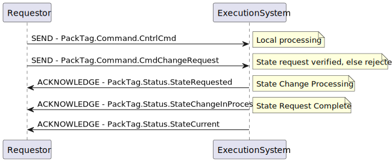
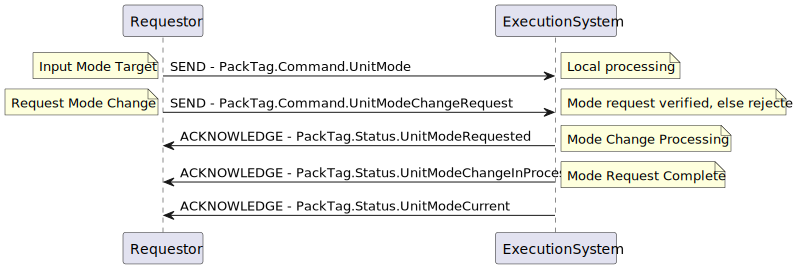

<h1 align="left">
  <br>
  
  <br>
  HEI-Vs Engineering School
  <br>
</h1>

# HEVS PackML

# Modification

This is the HEVS implementation of PackML of ISA-TR88.00.02-2022 in Structured Text for ctrlX Core

> This project contains CtrlX Project without links to hardware of the HEVS laboratories.

Author: [Cédric Lenoir](mailto:cedric.lenoir@hevs.ch)

# Time
Computation of time can be different, depending of system libraries.
Check that your system can provide information for ``hevsPackTime``.

```iecst
VAR_GLOBAL
	// HEVS Time, needed for Alarms and Time in Pack
	// Computed with PRG_GetTime_CtrlX
	//          or   PRG_GetTime_TwinCAT
	//			or   Your own system
	hevsPackTime	: HEVS_Time;
END_VAR
```
with

```iecst
TYPE HEVS_Time :
STRUCT
	Date_and_time_in_seconds	: UDINT;
	Local_date_time_seconds 	: UDINT;
	Date_and_time_format 		: DATE_AND_TIME;
	Date_and_time_string 		: STRING;		
END_STRUCT
END_TYPE
```

For CtrlX Core, you can use ``PRG_GetTime_CtrlX``.

# List of Function Blocks

## FB_PackMasterState
Gère les états machine en fonction de:
- Enable                    : BOOL;
- SC_StateComplete          : BOOL;
- Command_CntrlCmd			: DINT;
- Command_CmdChangeRequest	: BOOL;
    // In 32 bits, list of disabled states, by default: 0
- Admin_CurDisabledStates	: DWORD := 0;

```ìecst
FUNCTION_BLOCK FB_PackMasterState
VAR_INPUT
	Enable                      : BOOL;
	SC_StateComplete            : BOOL;
	Command_CntrlCmd			: DINT;
	Command_CmdChangeRequest	: BOOL;
    // In 32 bits, list of disabled states, by default: 0
	Admin_CurDisabledStates		: DWORD := 0;
END_VAR
VAR_OUTPUT
	Status_StateCurrent			: DINT;
END_VAR
```

### Admin_CurDisabledStates
Permet de désactiver certains états, avec exeption de:

Stopped - Idle - Execute - Aborted

Si un de ces états est Disabled, le bit est ignoré.

Si un état Wait est Disabled, le FB déscactive en interne les états Acting relatifs.
```iecst
IF (localDisabledStates.boolState.Held = 1) THEN
	localDisabledStates.boolState.Holding := 1;
	localDisabledStates.boolState.Unholding := 1;
END_IF
// Remove extra states for Suspend loop
IF (localDisabledStates.boolState.Suspended = 1) THEN
	localDisabledStates.boolState.Suspending := 1;
	localDisabledStates.boolState.Unsuspending := 1;
END_IF
// Remove extra states for Complete loop
IF (localDisabledStates.boolState.Completed = 1) THEN
	localDisabledStates.boolState.Completing := 1;
END_IF
```
Les états suivants peuvent être ignorés
|Command    |State        |transition ENUM          |Next Wait State ENUM  |
|-----------|-------------|-------------------------|----------------------|
|Abort      |Aborting     |E_PackState.eAborting    |E_PackState.eAborted  |
|Stop       |Stopping     |E_PackState.eStopping    |E_PackState.eStopped  |
|Clear      |Clearing     |E_PackState.eClearing    |E_PackState.eStopped  |
|Reset      |Resetting    |E_PackState.eResetting   |E_PackState.eIdle     |
|Reset      |Completing   |E_PackState.eCompleting  |E_PackState.eCompleted|
|Start      |Starting     |E_PackState.eStarting    |E_PackState.eExecute  |
|Hold       |Holding      |E_PackState.eHolding     |E_PackState.eHeld     |
|Unhold     |Unholding    |E_PackState.eUnholding   |E_PackState.eExecute  |
|Suspend    |Suspending   |E_PackState.eSuspending  |E_PackState.eSuspended|
|Unsuspend  |Unsuspending |E_PackState.eUnsuspending|E_PackState.eExecute  |

> Concrètement cela signifie.
- Pour les états **Wait**: la commande est ignorée, à savoir:
- **Hold**, 
- **Suspend**,
-  **Complete**.

- Pour les états **Acting** qui sont **Disabled**, la gestion est un petit peu lourde. Le simple fait de forcer le SC pourrait poser problème car cela appelerait un état qui n'est pas sensé l'être. Il est donc nécessaire de **tester le bit Disabled avant de changer d'état** pour passer le cas échéant dirctement dans l'etat stable suivant. ***Noter encore** que si l'état **Wait** suivant n'existe pas, l'état **Acting** considéré ne doit pas exister non plus et le problème n'existe pas*.

Pour simplifier le code, on a défini la méthode suivante: ``M_SkipDisabledState``. Noter l'accès ``PRIVATE``, car la méthode ne sert à rien en dehors du FB.

```iecst
METHOD PRIVATE M_SkipDisabledState : E_PackState
VAR_INPUT
	// Next state if statedisabled is FALSE
	baseTransition	: E_PackState;
	// Disabled condition, e.g. (localDisabledStates.boolState.Stopping = 1)
	statedisabled	: BOOL;
	// Next state if statedisabled is TRUE
	nextWaitState   : E_PackState;
END_VAR
```

#### CALL
```iecst
masterState := M_SkipDisabledState(baseTransition := E_PackState.eClearing, statedisabled := localDisabledStates.boolState.Clearing = 1, nextWaitState := E_PackState.eStopped);
```

### Note
Il n'y a pas de protection en cas de modification de Admin_CurDisabledStates en dehors des changements de mode, dans ce cas, le fonctionnement pourrait être instable.

## FB_PackMasterMode
Ce FB gère les modes en fonction de

**EnabledModesCfg** : 31 bits permettent chacun de configurer si le mode correspondant au bit est activable ou pas.
Etats actuels et Admin.ModeTransitionCfg[#], permet pour chaque mode de déterminer si depuis l'état à 1 dans un DWORD il est possible d'effectuer une transition.

Exemple: si pour le Mode Manuel, le bit correspondant à Stopped est à 1, alors il est possible de faire une transition **depuis** ce mode, **à condition** que bit Stopped dans le **futur état soit aussi disponible**.

### Les conditions pour démarrer un changement de mode

-	Flanc montant de ``Cmd_UnitModeChangeRequest``
-	``Cmd_UnitMode`` fournit un numéro de mode existant, voir aussi ``E_PackModes``.
-	``Cmd_UnitMode`` est différent du mode actuel, mémorisé dans le FB, voir aussi ``Sts_UnitModeCurrent``.
-	Le mode est actif, voir ``Admin_EnabledModesCfg``.
-	L'état actuel, ``Sts_StateCurrent`` est actif dans ``Admin_ModeTransitionCfg[#]``.


Les commandes:

> Jusqu'à maintenant, je me suis toujours contenté d'écrire des FB avec différents s. En relisant attentivemenet TR88 2022, je constate que en utilisant les mêmte outils on pourrait écrire différents FB de type FB_ModuleTest

> Could be nice to add a Method to change the time out default value. Easy to do.

# Liste des alarmes utiles à implémenter ou déjà implémentée.
> Pour FB_PackMasterState

- Mettre un flag CmdStateDisabled (L'état requis est désactivé)
- Mettre un flag TimeOut 

> Pour FB_PackMasterMode

- Indiquer si un changement de mode n'est pas possible.

## FB_ModuleTest
Ce module permet de tester la machine d'état principale.

Ce module retourne SC après 2.5 [s] pour chaque état.

```iecst
FUNCTION_BLOCK FB_ModuleTest
VAR_IN_OUT
	Status_StateCurrent: DINT;			// has to take the PackTag Status.StateCurrent
END_VAR
```

### Property SC Get
```iecst
SC := testSC.Q;
```

A propos de State Complete.
Ce flag n'existe pas dans PackTag, ni en 2008, ni en 2022

Dans ce module, si un état n'est pas utilisé, c'est simple, il retourne SC.
Cela rend le chainage des modules relativment simple, puisqu'il suffit de faire une chaine boolean OR pour obtenir le SC pour la machine d'état principale.

## FB_PackStateCmdBoolInterface
This Function Block is not part of PackML.

It helps implementation by converting cmd ``BOOL`` to ``E_PackCmd`` and Change Request.
Can be used with ``HEVS_PackTag_UI``.

### Use
```iecst
fbCmdBoolInterface(Reset := PackTag.hevsUI.uiReset,
                   Start := PackTag.hevsUI.uiStart,
                   Stop := PackTag.hevsUI.uiStop,
                   Hold := PackTag.hevsUI.uiHold,
                   Unhold := PackTag.hevsUI.uiUnhold,
                   Suspend := PackTag.hevsUI.uiSuspend,
                   Unsuspend := PackTag.hevsUI.uiUnsuspend,
                   Abort := PackTag.hevsUI.uiAbort,
                   Clear := PackTag.hevsUI.uiClear,
                   Complete := PackTag.hevsUI.uiComplete,
                   // Output to Pack Command
                   eCntrlCmd => PackTag.Command.CntrlCmd,
                   bCmdChangeRequest => PackTag.Command.CmdChangeRequest);
```

## FB_GetActualBoolState
This Function Block is not part of PackML.
It helps implementation by converting StateCurrent ``E_PackState`` to ``BOOL``.
Can be used with ``HEVS_PackTag_UI``.

### Use
```iecst
fbGetActualBoolState(Enable := TRUE,
                     ePackState := PackTag.Status.StateCurrent,
                     Clearing => PackTag.hevsUI.uiClearing,
                     Stopped => PackTag.hevsUI.uiStopped,
                     Starting => PackTag.hevsUI.uiStarting,
                     Idle => PackTag.hevsUI.uiIdle,
                     Suspended => PackTag.hevsUI.uiSuspended,
                     Execute => PackTag.hevsUI.uiExecute,
                     Stopping => PackTag.hevsUI.uiStopping,
                     Aborting => PackTag.hevsUI.uiAborting,
                     Aborted => PackTag.hevsUI.uiAborted,
                     Holding => PackTag.hevsUI.uiHolding,
                     Held => PackTag.hevsUI.uiHeld,
                     Unholding => PackTag.hevsUI.uiUnholding,
                     Suspending => PackTag.hevsUI.uiSuspending,
                     Unsuspending => PackTag.hevsUI.uiUnsuspending,
                     Resetting => PackTag.hevsUI.uiResetting,
                     Completing => PackTag.hevsUI.uiCompleting,
                     Completed => PackTag.hevsUI.uiCompleted); 
```

# State change sequence

<figure>
    
    <figcaption>State change example sequence</figcaption>
</figure>

# Unit mode change sequence

<figure>
    
    <figcaption>Unit mode change example sequence</figcaption>
</figure>

# Ressources

[Schneider Electric Guide de la bibliothèque PackML 2022](https://product-help.schneider-electric.com/Machine%20Expert/V2.2/fr/PackMLli/index.htm#t=PackMLli%2FTPC_PackMLli_FB_UnitModeManager2_StateModel.html)

A noter que Schneider Electric propose désormais un guide très complet qui utiliser les fonctions orientées objet, à savoir les méthodes.

[FB_UnitModeManager2](https://product-help.schneider-electric.com/Machine%20Expert/V2.2/fr/PackMLli/index.htm#t=PackMLli%2FTPC_PackMLli_FB_UnitModeManager2.html)

**A modifier:** PackTag.hevsPackTime.Date_and_time_format;
Passer directement par le PackTag.
